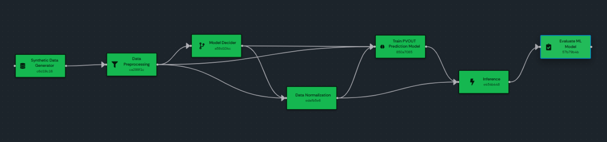

# Prediction Workflow — Domino DAG Configuration

End-to-end PVOUT prediction pipeline:

```
SyntheticDataGenerator
    │
    ▼
DataPreprocessing
    ├──────────────────┐
    ▼                  │
ModelDecider           │
    ├──────────┐       │
    ▼          │       │
DataNormalization      │
    │   │              │
    │   └─────┐        │
    ▼        ▼         ▼
PVOUTPredictionModelTrain ◄────┘
    │       │
    │       └────────┐
    ▼                ▼
Inference (← Normalization, ← DataPreprocessing for features)
    │
    ▼
EvaluateMLModel
```



**Why the fan-out:** every "consumer" piece needs an explicit edge from each "producer" piece it pulls from. Domino's Upstream dropdown only shows fields from direct parents, not transitive ancestors. See the per-piece tables below for which edges feed which field.

## DAG edges to draw

| From | To | Reason |
|---|---|---|
| Synthetic | DataPreprocessing | dataset file |
| DataPreprocessing | DataNormalization | data_path |
| DataPreprocessing | PVOUTPredictionModelTrain | feature_columns |
| DataPreprocessing | Inference | feature_columns |
| ModelDecider | DataNormalization | normalization_type |
| ModelDecider | PVOUTPredictionModelTrain | model_type, target_column |
| DataNormalization | PVOUTPredictionModelTrain | data_path |
| DataNormalization | Inference | data_path |
| PVOUTPredictionModelTrain | Inference | model_path |
| Inference | EvaluateMLModel | forecast_csv_path |

---

## SyntheticDataGeneratorPiece

| Field | Value | Upstream |
|---|---|---|
| Dataset Type | `solargis` | — |
| Output Mode | `batch_sample` | — |
| Output Format | `csv` | — |
| Records Count | `100` (any >0) | — |
| Time Step Minutes | `15` | — |
| Seed | (optional) | — |

Produces `dataset_batch.csv` in its `results/`.

## DataPreprocessingPiece

| Field | Value | Upstream |
|---|---|---|
| Preprocessing Option | `prediction` | — |
| Data Path | ← **SyntheticDataGenerator.File Path** | ✓ |
| Save Data Path | (leave empty — defaults to `<results_path>/preprocessed.csv`) | — |
| Test Size | (leave empty) | — |
| Keep Datetime | unchecked / `false` | — |

**Important:** keep `keep_datetime` off. If it's on, `datetime` ends up in feature_columns and the trainer's numeric coercion will null-out every row.

Produces `preprocessed.csv` and emits `Data Path`, `Feature Columns` (numeric only), `Target Column = PVOUT` as typed outputs.

## ModelDeciderPiece

| Field | Value | Upstream |
|---|---|---|
| Problem Type | `pvout_prediction` | — |
| Horizon | `1` | — |
| Available Models | `+` → `xgb_regressor_model` | — |
| Feature Columns | (leave empty) | — |
| Target Column | `PVOUT` | — |

Decider auto-picks `xgb_regressor_model` from Available Models and infers `normalization_type=none` because XGBoost doesn't need scaling. Produces `decision.json`.

## DataNormalizationPiece

| Field | Value | Upstream |
|---|---|---|
| Normalization Type | ← **ModelDecider.Normalization Type** | ✓ |
| Features | (leave empty) | — |
| Data Path | ← **DataPreprocessing.Data Path** | ✓ |
| Dataframe | (leave empty) | — |

For XGBoost the decider sets normalization to `none` → the piece does a passthrough but still writes `normalized.csv` under its `results/` for traceability.

## PVOUTPredictionModelTrainPiece

| Field | Value | Upstream |
|---|---|---|
| Model Type | ← **ModelDecider.Model Type** | ✓ |
| Data Path | ← **DataNormalization.Data Path** | ✓ |
| Csv Path | (leave empty — alias for Data Path) | — |
| Feature Columns | ← **DataPreprocessing.Feature Columns** | ✓ |
| Target Column | ← **ModelDecider.Target Column** | ✓ |
| Checkpoint Dir | (leave empty — defaults to `results_path`) | — |

Produces `pvout_prediction_xgb_regressor_model.pkl` and emits `Model Path` (string) as typed output for Inference.

## InferencePiece

| Field | Value | Upstream |
|---|---|---|
| Mode | `pvout_correction` | — |
| Model Path | ← **PVOUTPredictionModelTrain.Model Path** | ✓ |
| Data Path | ← **DataNormalization.Data Path** | ✓ |
| Feature Columns | ← **DataPreprocessing.Feature Columns** | ✓ |
| Datetime Column | `datetime` | — |
| Base Forecast Column | `PVOUT` | — |
| Horizon Column | (leave empty — only set when `flag_each_day=true` on preprocessor) | — |
| Max Horizon | (leave empty) | — |

Produces `forecast.csv` (datetime + base_forecast + correction + final_forecast + PVOUT) and emits `Forecast Csv Path` for the evaluator.

**Semantic note about Mode:**
- `pvout_correction` computes `final_forecast = PVOUT + model.predict(X)`. With `base_forecast_column=PVOUT`, this means `final_forecast = truth + prediction`. It runs, but `final_forecast - PVOUT` is just the model prediction, not an error.
- `price_level` computes `final_forecast = model.predict(X)` directly with no baseline. For pure prediction semantics, switch Mode to this and leave Base Forecast Column blank.

## EvaluateMLModelPiece

| Field | Value | Upstream |
|---|---|---|
| Evaluation Option | `normal` | — |
| Baseline Id | `1` | — |
| Plot | unchecked | — |
| Forecast Column | `correction` (for `pvout_correction` Mode) **or** `final_forecast` (for `price_level` Mode) | — |
| Target Column | `PVOUT` | — |
| Pred Df Path | ← **Inference.Forecast Csv Path** | ✓ |
| True Baseline Df Path | (leave empty — only for `errorcorrection` mode) | — |
| Pred Df / True Baseline Df / Y True | (leave empty) | — |

Produces `metrics.json` with `mae`, `rmse`, `mape`, `forecast_column`, `target_column`, `n`.

**Why `correction` not `final_forecast` for `pvout_correction` Mode:** see the Inference semantic note above. `correction` = `model.predict(X)`, so `correction - PVOUT` measures actual prediction error.

---

## Quick sanity checklist before each run

- All four images pulled fresh after CI publishes:
  ```
  docker pull ghcr.io/iisas/spice_smart_grid_pieces:dev-3-group0
  docker pull ghcr.io/iisas/spice_smart_grid_pieces:dev-3-group1
  docker pull ghcr.io/iisas/spice_smart_grid_pieces:dev-3-group2
  ```
- Domino piece repository refreshed to the latest `dev-3` release so the DAG points at current images and exposes the latest typed fields.
- All edges from the table above are drawn on the canvas.
- ModelDecider's Available Models contains `xgb_regressor_model`.
- DataPreprocessing's Keep Datetime is off.

## Files dropped into each piece's `results/`

| Piece | File | Purpose |
|---|---|---|
| Synthetic | `dataset_batch.csv` | input dataset |
| DataPreprocessing | `preprocessed.csv` | numeric-only features + PVOUT |
| ModelDecider | `decision.json` | chosen `model_type`, `normalization_type` |
| DataNormalization | `normalized.csv` | passthrough (or scaled) version of preprocessed |
| PVOUTPredictionModelTrain | `pvout_prediction_<model_type>.pkl` | trained model checkpoint |
| Inference | `forecast.csv` | datetime + base_forecast + correction + final_forecast + PVOUT |
| EvaluateMLModel | `metrics.json` | MAE / RMSE / MAPE |

All these land on the host through Domino's `results_path` mount — no Docker exec needed to inspect them.
