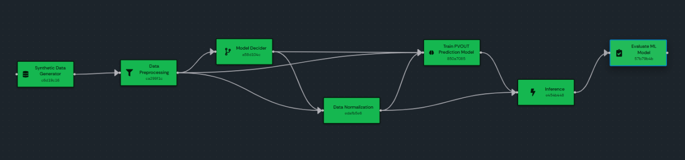

# Prediction Workflow — Domino DAG Configuration

End-to-end PVOUT prediction pipeline. The pipeline is a **linear chain** with a single side-branch at the very end (Evaluate and Explainable both consume Inference in parallel). PVOUTErrorCorrectionModelTrain is an **optional inline stage** between the baseline trainer and Inference — drop it in when you want a residual-correction layer, leave it out otherwise.

```
SyntheticDataGenerator
    │
    ▼
DataPreprocessing
    │
    ▼
ModelDecider
    │
    ▼
DataNormalization
    │
    ▼
PVOUTPredictionModelTrain
    │
    ▼
[ PVOUTErrorCorrectionModelTrain ]   (optional inline stage)
    │
    ▼
InferencePiece
    │
    ├──► EvaluateMLModel
    │
    └──► ExplainablePrediction        (optional, sibling of Evaluate)
```



**Why a linear chain works:** every piece's `OutputModel` echoes the relevant upstream context (`feature_columns`, `target_column`, `model_type`, `data_path`, and so on). Each consumer therefore needs **exactly one** upstream edge to its immediate predecessor, instead of fanning back to every original producer. The Inference → {Evaluate, Explainable} fan-out is the only branch in the graph, because Evaluate and Explainable are independent consumers of the trained model with nothing to gain from being serialized.

## DAG edges to draw

### Core flow

| From | To | Reason |
|---|---|---|
| Synthetic | DataPreprocessing | dataset file |
| DataPreprocessing | ModelDecider | data_path, feature_columns, target_column |
| ModelDecider | DataNormalization | normalization_type (+ echoes: data_path, feature_columns, target_column, model_type) |
| DataNormalization | PVOUTPredictionModelTrain | data_path (+ echoes: feature_columns, target_column, model_type) |
| PVOUTPredictionModelTrain | InferencePiece | model_path (+ echoes: data_path, feature_columns, target_column) |
| InferencePiece | EvaluateMLModel | forecast_csv_path |
| InferencePiece | ExplainablePrediction | model_path, data_path, feature_columns (all echoed by Inference) |

### Optional inline stage — drop in for the error-correction variant

| From | To | Reason |
|---|---|---|
| PVOUTPredictionModelTrain | PVOUTErrorCorrectionModelTrain | baseline_model_path = upstream model_path (+ echoes: data_path, feature_columns, target_column) |
| PVOUTErrorCorrectionModelTrain | InferencePiece | model_path of correction model (replaces the trainer→inference edge above; the original `baseline_model_path` is still echoed for staged inference) |

That's **7 edges** for the canonical flow, **8** with the error-correction stage inserted — down from ~14–19 in the previous fan-out layout.

---

## SyntheticDataGeneratorPiece

| Field | Value | Upstream |
|---|---|---|
| Dataset Type | `solargis` | — |
| Output Mode | `batch_sample` | — |
| Output Format | `csv` | — |
| Records Count | `100` (any >0) | — |
| Time Step Minutes | `15` | — |
| Seed | (optional) | — |

Produces `dataset_batch.csv` in its `results/`.

## DataPreprocessingPiece

| Field | Value | Upstream |
|---|---|---|
| Preprocessing Option | `prediction` | — |
| Data Path | ← **SyntheticDataGenerator.File Path** | ✓ |
| Save Data Path | (leave empty — defaults to `<results_path>/preprocessed.csv`) | — |
| Test Size | (leave empty) | — |
| Keep Datetime | unchecked / `false` | — |

**Important:** keep `keep_datetime` off. If it's on, `datetime` ends up in feature_columns and the trainer's numeric coercion will null-out every row.

Produces `preprocessed.csv` and emits `Data Path`, `Feature Columns`, `Target Column = PVOUT` as typed outputs.

## ModelDeciderPiece

| Field | Value | Upstream |
|---|---|---|
| Problem Type | `pvout_prediction` | — |
| Horizon | `1` | — |
| Available Models | `+` → `xgb_regressor_model` | — |
| Feature Columns | ← **DataPreprocessing.Feature Columns** | ✓ |
| Target Column | ← **DataPreprocessing.Target Column** | ✓ |
| Data Path | ← **DataPreprocessing.Data Path** | ✓ |

Decider auto-picks `xgb_regressor_model` from Available Models and infers `normalization_type=none` because XGBoost doesn't need scaling. Echoes `data_path`, `feature_columns`, `target_column` so DataNormalization can pick them up from a single edge.

## DataNormalizationPiece

| Field | Value | Upstream |
|---|---|---|
| Normalization Type | ← **ModelDecider.Normalization Type** | ✓ |
| Features | (leave empty) | — |
| Data Path | ← **ModelDecider.Data Path** | ✓ |
| Dataframe | (leave empty) | — |
| Feature Columns | ← **ModelDecider.Feature Columns** | ✓ |
| Target Column | ← **ModelDecider.Target Column** | ✓ |
| Model Type | ← **ModelDecider.Model Type** | ✓ |

For XGBoost the decider sets normalization to `none` → the piece does a passthrough but still writes `normalized.csv` under its `results/` for traceability. Re-emits `feature_columns`, `target_column`, `model_type` (echoed from upstream) plus its own `data_path` for the trainer.

## PVOUTPredictionModelTrainPiece

| Field | Value | Upstream |
|---|---|---|
| Model Type | ← **DataNormalization.Model Type** | ✓ |
| Data Path | ← **DataNormalization.Data Path** | ✓ |
| Csv Path | (leave empty — alias for Data Path) | — |
| Feature Columns | ← **DataNormalization.Feature Columns** | ✓ |
| Target Column | ← **DataNormalization.Target Column** | ✓ |
| Checkpoint Dir | (leave empty — defaults to `results_path`) | — |

Produces `pvout_prediction_xgb_regressor_model.pkl` and emits `Model Path` plus echoed `Data Path`, `Feature Columns`, `Target Column` as typed outputs for the next piece in the chain.

## PVOUTErrorCorrectionModelTrainPiece *(optional inline stage)*

Drop this node between the baseline trainer and Inference when you want a second-stage XGBoost trained on the residual `PVOUT − PVOUT_PRED`. With `baseline_model_path` wired up, the piece auto-generates `PVOUT_PRED` from the upstream baseline checkpoint — no extra inference step needed during training.

| Field | Value | Upstream |
|---|---|---|
| Model Type | `error_correction_xgb_regressor_model` | — |
| Data Path | ← **PVOUTPredictionModelTrain.Data Path** | ✓ |
| Baseline Model Path | ← **PVOUTPredictionModelTrain.Model Path** | ✓ |
| Feature Columns | ← **PVOUTPredictionModelTrain.Feature Columns** | ✓ |
| Target Column | ← **PVOUTPredictionModelTrain.Target Column** | ✓ |
| Model Setup → Pred Column | (leave empty — defaults to `PVOUT_PRED`, auto-filled from the baseline checkpoint) | — |
| Checkpoint Dir | (leave empty — defaults to `results_path`) | — |

Produces `pvout_error_correction_<model_type>.pkl` (same `{"metadata", "trained_model_object"}` envelope as the baseline trainer). Emits its own `Model Path` (correction model) plus echoed `Data Path`, `Feature Columns`, `Target Column`, and `Baseline Model Path` (the upstream baseline's model_path, forwarded so InferencePiece can run staged inference from a single edge).

**Other supported Model Types** — same options as before (`error_correction_residual_meta_xgb_regressor_model`, `error_correction_difficulty_weighted_xgb_regressor_model`, `linear_regression`, `ridge_regression`). Only the XGB variants need `Baseline Model Path`.

## InferencePiece

Inference has two viable shapes depending on whether the error-correction stage is in the DAG. In both shapes the **single upstream edge** is the piece immediately to its left in the chain.

### Shape A — baseline only (chain ends `… → Trainer → Inference`)

| Field | Value | Upstream |
|---|---|---|
| Mode | `pvout_correction` | — |
| Model Path | ← **PVOUTPredictionModelTrain.Model Path** | ✓ |
| Data Path | ← **PVOUTPredictionModelTrain.Data Path** | ✓ |
| Feature Columns | ← **PVOUTPredictionModelTrain.Feature Columns** | ✓ |
| Target Column | ← **PVOUTPredictionModelTrain.Target Column** | ✓ |
| Datetime Column | `datetime` | — |
| Base Forecast Column | `PVOUT` | — |
| Horizon Column | (leave empty — only set when `flag_each_day=true` on preprocessor) | — |
| Max Horizon | (leave empty) | — |

Produces `forecast.csv` (datetime + base_forecast + correction + final_forecast + PVOUT) and emits `Forecast Csv Path` for the evaluator, plus echoed `Model Path`, `Data Path`, `Feature Columns`, `Target Column` for ExplainablePrediction.

**Semantic note about Mode:**
- `pvout_correction` computes `final_forecast = PVOUT + model.predict(X)`. With `base_forecast_column=PVOUT`, this means `final_forecast = truth + prediction`. It runs, but `final_forecast − PVOUT` is just the model prediction, not an error.
- `price_level` computes `final_forecast = model.predict(X)` directly with no baseline. For pure prediction semantics, switch Mode to this and leave Base Forecast Column blank.

### Shape B — staged baseline + correction (chain ends `… → Trainer → ErrorCorrect → Inference`)

| Field | Value | Upstream |
|---|---|---|
| Mode | (leave empty — `Stages` overrides it) | — |
| Model Path | ← **PVOUTErrorCorrectionModelTrain.Model Path** | ✓ |
| Data Path | ← **PVOUTErrorCorrectionModelTrain.Data Path** | ✓ |
| Feature Columns | ← **PVOUTErrorCorrectionModelTrain.Feature Columns** | ✓ |
| Target Column | ← **PVOUTErrorCorrectionModelTrain.Target Column** | ✓ |
| Stages | see JSON below — wire `model_path` of stage 1 to **PVOUTErrorCorrectionModelTrain.Baseline Model Path** | ✓ |

```json
[
  {
    "mode": "price_level",
    "model_path": "<PVOUTErrorCorrectionModelTrain.Baseline Model Path>",
    "feature_columns": "<PVOUTErrorCorrectionModelTrain.Feature Columns>",
    "inject_forecast_as": "PVOUT_PRED"
  },
  {
    "mode": "pvout_correction",
    "model_path": "<PVOUTErrorCorrectionModelTrain.Model Path>",
    "feature_columns": "<PVOUTErrorCorrectionModelTrain.Feature Columns>",
    "base_forecast_column": "PVOUT_PRED"
  }
]
```

Produces a `forecast.csv` whose `final_forecast = PVOUT_PRED + correction(X)` — the actual error-corrected forecast.

## EvaluateMLModelPiece

| Field | Value | Upstream |
|---|---|---|
| Evaluation Option | `normal` | — |
| Baseline Id | `1` | — |
| Plot | unchecked | — |
| Forecast Column | `correction` (Shape A) **or** `final_forecast` (Shape B / `price_level` mode) | — |
| Target Column | `PVOUT` | — |
| Pred Df Path | ← **Inference.Forecast Csv Path** | ✓ |
| True Baseline Df Path | (leave empty — only for `errorcorrection` mode) | — |
| Pred Df / True Baseline Df / Y True | (leave empty) | — |

Produces `metrics.json` with `mae`, `rmse`, `mape`, `forecast_column`, `target_column`, `n`.

**Why `correction` not `final_forecast` for Shape A:** see the Inference semantic note above. `correction` = `model.predict(X)`, so `correction − PVOUT` measures actual prediction error. For Shape B (staged), `final_forecast` is the meaningful corrected forecast, so use it directly.

## ExplainablePredictionPiece *(optional, sibling of Evaluate)*

Drop this in parallel with EvaluateMLModelPiece — both consume InferencePiece, neither feeds the other.

| Field | Value | Upstream |
|---|---|---|
| Explain | `true` | — |
| Explain Method | `shap` (default when `explain=true`) | — |
| Model Path | ← **Inference.Model Path** | ✓ |
| Data Path | ← **Inference.Data Path** | ✓ |
| Feature Columns | ← **Inference.Feature Columns** | ✓ |
| Target Column | ← **Inference.Target Column** (informational) | ✓ |
| Use Diagnostic Loss | unchecked unless the upstream correction trainer was built with `use_diagnostic_loss=True` | — |

Produces `artifacts.explainability` (`shap_values`, `feature_names`, `base_value`, `explainer_type=TreeExplainer`). When the upstream correction model was trained with `use_diagnostic_loss=True` and `Use Diagnostic Loss=true` is checked here, also produces `artifacts.diagnostic_heatmaps` with base64-encoded heatmaps over `(horizon × regime)` and `(horizon × hour)`.

The piece transparently explains whichever model Inference used — baseline (Shape A) or correction (Shape B). No re-wiring needed when toggling the error-correction stage.

---

## Quick sanity checklist before each run

- All four images pulled fresh after CI publishes:
  ```
  docker pull ghcr.io/iisas/spice_smart_grid_pieces:dev-3-group0
  docker pull ghcr.io/iisas/spice_smart_grid_pieces:dev-3-group1
  docker pull ghcr.io/iisas/spice_smart_grid_pieces:dev-3-group2
  ```
- Domino piece repository refreshed to the latest `dev-3` release so the DAG points at current images and exposes the latest typed fields.
- The chain has exactly one edge between consecutive pieces. The only fan-out is Inference → {Evaluate, Explainable}.
- ModelDecider's Available Models contains `xgb_regressor_model`.
- DataPreprocessing's Keep Datetime is off.
- **If using the error-correction stage:** Baseline Model Path on the correction trainer is wired to the baseline trainer's Model Path, and the inference node receives its single edge from the correction trainer (not from the baseline trainer).
- **If using staged inference (Shape B):** the `stages` JSON references both checkpoints, with `model_path` of stage 1 = `Baseline Model Path` echoed forward by the correction trainer.

## Files dropped into each piece's `results/`

| Piece | File | Purpose |
|---|---|---|
| Synthetic | `dataset_batch.csv` | input dataset |
| DataPreprocessing | `preprocessed.csv` | numeric-only features + PVOUT |
| ModelDecider | `decision.json` | chosen `model_type`, `normalization_type` |
| DataNormalization | `normalized.csv` | passthrough (or scaled) version of preprocessed |
| PVOUTPredictionModelTrain | `pvout_prediction_<model_type>.pkl` | trained baseline model checkpoint |
| PVOUTErrorCorrectionModelTrain *(optional)* | `pvout_error_correction_<model_type>.pkl` | trained correction model checkpoint |
| Inference | `forecast.csv` | datetime + base_forecast + correction + final_forecast + PVOUT |
| EvaluateMLModel | `metrics.json` | MAE / RMSE / MAPE |
| ExplainablePrediction *(optional)* | (artifacts only, no on-disk file by default) | SHAP `shap_values` + `feature_names` (+ optional diagnostic heatmaps as base64 PNGs in artifacts) |

All these land on the host through Domino's `results_path` mount — no Docker exec needed to inspect them.
